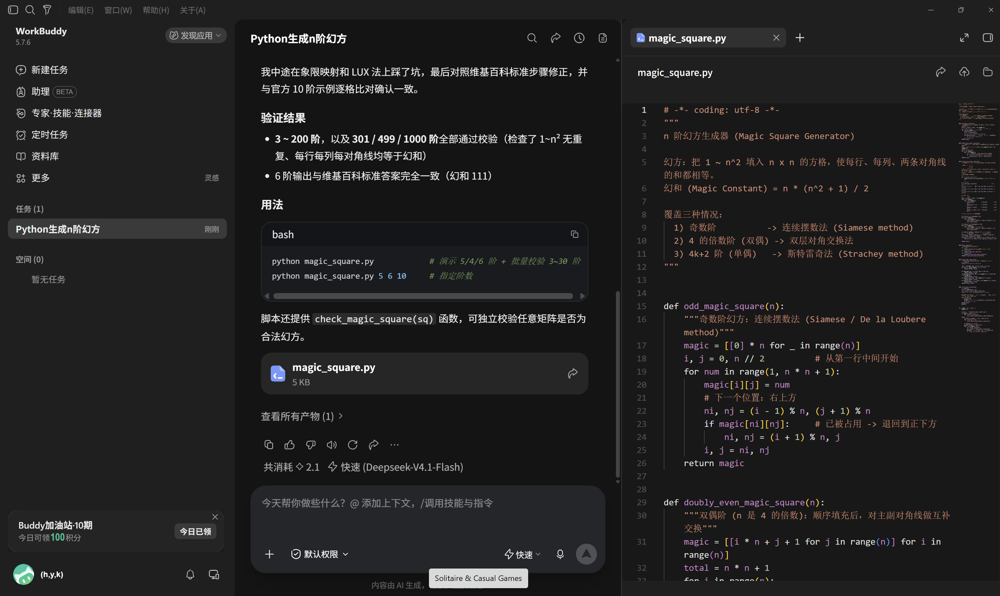
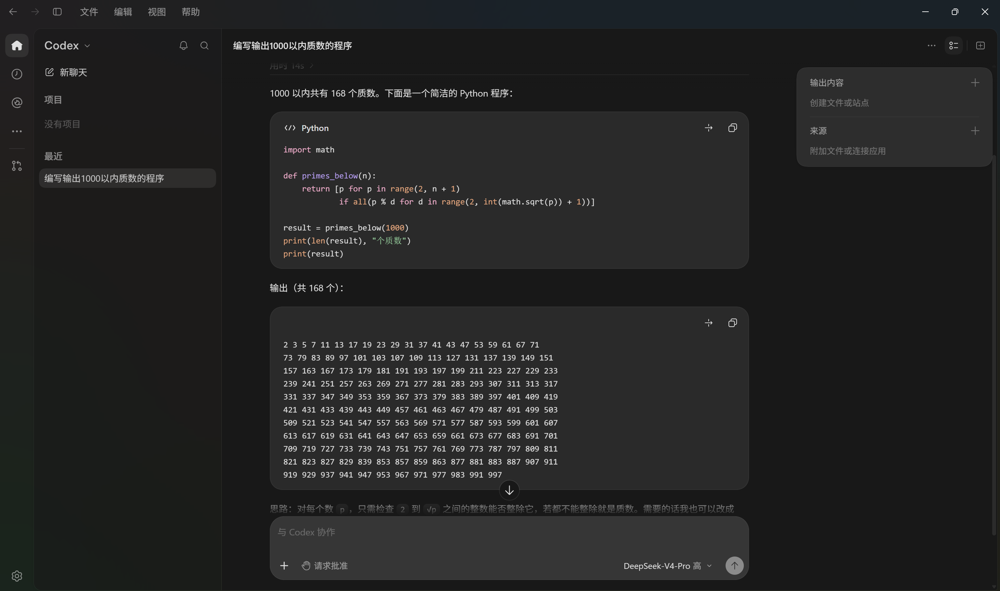
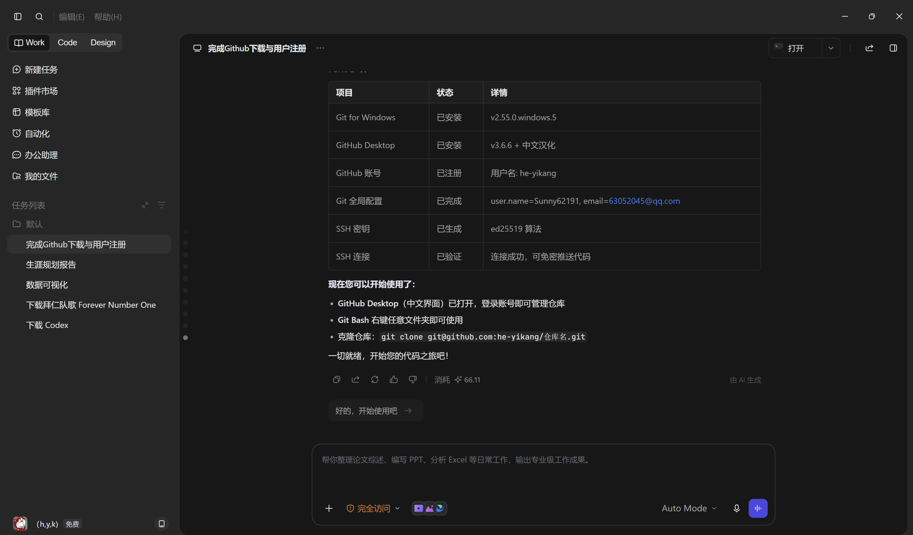

# AI 编程工具作品展示

使用 WorkBuddy、DeepSeek Codex 等 AI 编程工具生成的作品，展示人工智能辅助编程的强大能力。

---

## 作品一：Python 生成 N 阶幻方

**工具：** WorkBuddy · DeepSeek-V4.1-Flash

使用连续摆数法（奇数阶）、双层对角交换法（双偶阶）、斯特雷奇法（单偶阶）三种算法，实现了覆盖所有情况的 N 阶幻方生成器。经过 3~200 阶，以及 301/499/1000 阶的全面校验，每行、每列、两条对角线的和均等于幻和。

---

## 作品二：1000 以内质数生成器

**工具：** DeepSeek Codex · V4-Pro

使用试除法生成 1000 以内的所有质数，共 168 个。核心思路：对每个数 p，只需检查 2 到 √p 之间的整数能否整除，若都不能整除就是质数。

---

## 作品三：GitHub 环境一键配置

**工具：** TRAE · AI 编程助手

通过 AI 助手完成 Git for Windows 安装、GitHub Desktop 下载与汉化、GitHub 账号注册、Git 全局配置、SSH 密钥生成与验证等全流程自动化操作。从零基础到代码推送，一步到位。

---

> Powered by AI · 作品由 WorkBuddy、DeepSeek Codex、TRAE 等 AI 工具生成
